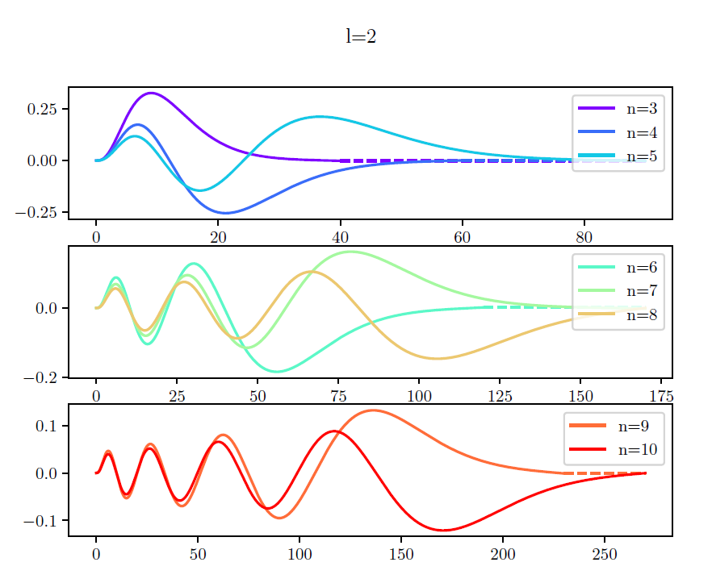

In this project I solved the Schrődinger equation for a particular case using the combination of shooting and Numerov methods.
As it is of a similar form, I also solved an equation that describes light propagation in dispersive media.

    

