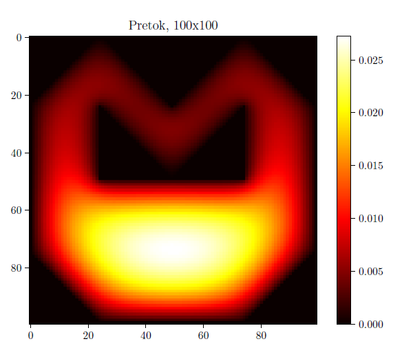

In this project I've solved a PDE with the finite difference methods with iteration schemes (Gauss-Seidler/Jacobi with SOR).
Conrecretly I solved the Poisson's equation (in this context it amounts to a fluid mechanics simulation).

    

