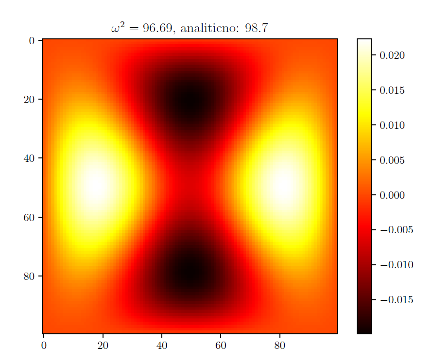

In this project I've found eigenvalues of a particular differential operator.
In particular - we were interested in vibration eigennmodes of a membrane. It was obtained by discretising (finite differences) the Laplacian and solving
the resulting generalised eigenvalue problem numerically.

    

