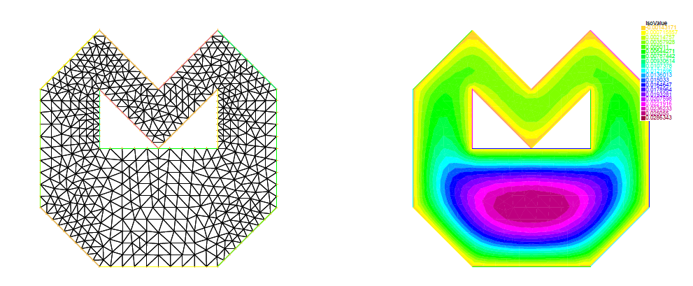

In this project I've solved a PDE (again Poisson) using the Finite Element Method (FEM).
I have first implemented the triangulation and the method itself myself, testing it extensively, and then compared
my results to the FreeFEM++ library.

    

