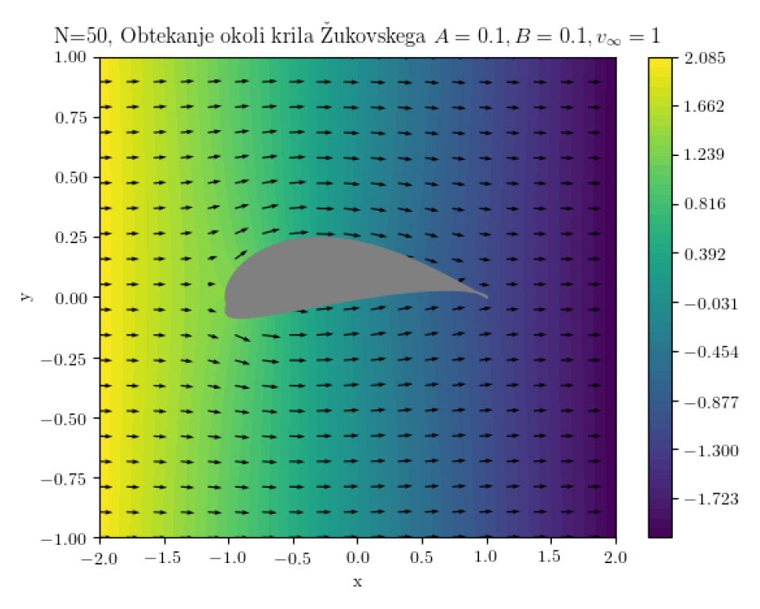

In this project I've implemented and applied the Boundary Element Method (BEM) to:
- A problem of determining the electrostatic potential in a certain geometry.
- A problem of determining a fluid flow around the object, shaped like an airplane wing.

    

