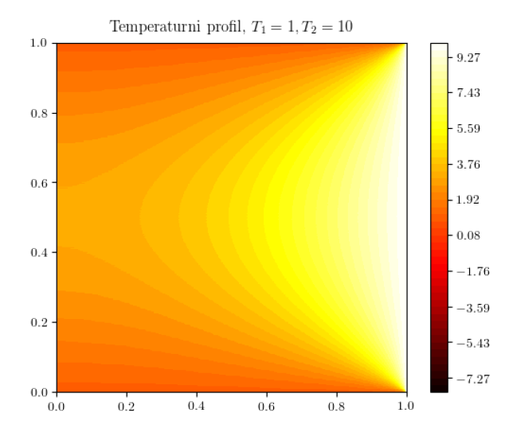

In this project I've solved some PDEs using spectral methods:
- Laplacian, expanding in Fourier basis (sine/cosine series as appropriate)
- Heat equation on a cyllinder, appropriately expanding again.

    

